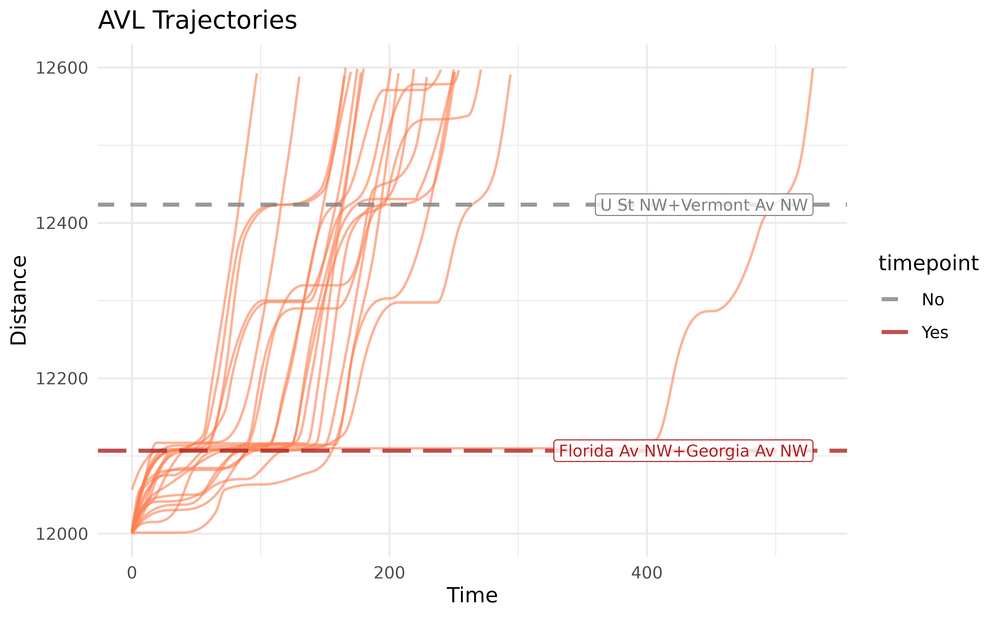

# Introduction to Trajectories

## Introduction

In the previous vignette
([`vignette("data-workflow")`](https://obrien-ben.github.io/transittraj/articles/data-workflow.md)),
we saw how we can use `transittraj` to clean our AVL data. We took care
of outliers, deadheading trips, noise, and non-monotonic observations.
In this vignette, we’ll apply the cleaned data (`c53_mono`) to fit a
trajectory function.

Let’s begin by loading the libraries we’ll be using:

``` r
library(transittraj)
library(tidytransit)
library(dplyr)
library(sf)
library(ggplot2)
```

## Fitting a Trajectory Curve

Our ultimate goal is to fit an interpolating curve describing the
position of a transit vehicle at any point in time. Ideally, we could
fit an inverse curve, giving us the time the transit vehicle passes any
point in space. We can do both using
[`get_trajectory_fun()`](https://obrien-ben.github.io/transittraj/reference/get_trajectory_fun.md).

`transittraj` supports many different methods for fitting these
functions. The simplest is linear interpolation without an inverse. For
more fine-grained analyses, though, we recommend fitting a
*velocity-informed piecewise cubic interpolating polynomial*. This uses
the speeds and distances, correct for monotonicity, to fit a cubic
spline between each observation. This is the type of curve that
[`get_trajectory_fun()`](https://obrien-ben.github.io/transittraj/reference/get_trajectory_fun.md)
will fit by default (`interp_method = "monoH.FC"` and
`use_speeds = TRUE`).

Using the data we cleaned in the previous vignette, let’s fit our
trajectory functions:

``` r
# Run function
c53_traj <- get_trajectory_fun(distance_df = c53_mono,
                               interp_method = "monoH.FC",
                               use_speeds = TRUE,
                               find_inverse_fun = TRUE)
```

Now we have a trajectory for each trip in `c53_mono`. `transittraj`
stores the fit curves in a special object class. This object stores a
list of fit trajectories, one for each trip, as well as the time and
distances ranges for each trip. We can use
[`summary()`](https://rdrr.io/r/base/summary.html) to take a look inside
the object:

``` r
summary(c53_traj)
#> ------
#> AVL Group Trajectory Object
#> ------
#> Number of trips: 24
#> Total distance range: 0 to 15370.75
#> Total time range: 1771257490 to 1771275553
#> ------
#> Trajectory function present: TRUE
#>    --> Trajectory interpolation method: monoH.FC
#>    --> Maximum derivative: 3
#>    --> Fit with speeds: TRUE
#> Inverse function present: TRUE
#>    --> Inverse function tolerance: 0.01
#> ------
```

## Interpolating

How do you use the fit curve to actually interpolate at new points? We
recommend using [`predict()`](https://rdrr.io/r/stats/predict.html), as
this will ensure that the curves aren’t used to extrapolate beyond the
range of each trip. Using
[`predict()`](https://rdrr.io/r/stats/predict.html), there are three
main values we can interpolate for: time from distances (requires an
inverse function), distances from times, and speeds from times (requires
a spline).

### Interpolating for Times

One of the most common applications of the fit trajectory curve is to
find the time at which each vehicle passed a point along its route. To
do this, we’ll use [`predict()`](https://rdrr.io/r/stats/predict.html)
with the `new_distances` parameter. We’ll begin by finding the distance
of each stop along the route using
[`get_stop_distances()`](https://obrien-ben.github.io/transittraj/reference/get_stop_distances.md):

``` r
# First, use stop_times to find which stop_ids are timepoints
c53_timepoints <- c53_gtfs$stop_times %>%
  distinct(stop_id, timepoint)

# Now, find stop distances and join the timepoints column
c53_stops <- get_stop_distances(gtfs = c53_gtfs,
                                shape_geometry = c53_shape,
                                project_crs = dc_CRS) %>%
  # Join timepoint info & stop name to each stop ID
  left_join(y = c53_timepoints,
            by = "stop_id") %>%
  left_join(y = (c53_gtfs$stops %>% select(stop_id, stop_name)),
            by = "stop_id") %>%
  # Polish up the result
  select(-shape_id) %>%
  mutate(timepoint = if_else(condition = (timepoint == 1),
                             true = "Yes",
                             false = "No"))

# Print header
head(c53_stops)
#> # A tibble: 6 × 4
#>   stop_id distance timepoint stop_name                  
#>   <chr>      <dbl> <chr>     <chr>                      
#> 1 2584        677. No        Alabama Av SE+15 Pl SE     
#> 2 2609        880. No        Alabama Av SE+Stanton Rd SE
#> 3 2683       1155. No        Alabama Av SE+18 Pl SE     
#> 4 2793       1605. No        Alabama Av SE+22 St SE     
#> 5 2811       1807. No        Alabama Av SE+24 St SE     
#> 6 2867       2037. No        Alabama Av SE+Jasper St SE
```

Now that we have some distances, let’s interpolate using
[`predict()`](https://rdrr.io/r/stats/predict.html):

``` r
# Run interpolating function
c53_stop_crossings <- predict(
  object = c53_traj,
  new_distances = c53_stops
)

# Print header
head(c53_stop_crossings)
#> # A tibble: 6 × 6
#>   stop_id distance timepoint stop_name              trip_id_performed     interp
#>   <chr>      <dbl> <chr>     <chr>                  <chr>                  <dbl>
#> 1 2584        677. No        Alabama Av SE+15 Pl SE 10185100              1.77e9
#> 2 2584        677. No        Alabama Av SE+15 Pl SE 10249100              1.77e9
#> 3 2584        677. No        Alabama Av SE+15 Pl SE 1306100               1.77e9
#> 4 2584        677. No        Alabama Av SE+15 Pl SE 13437100              1.77e9
#> 5 2584        677. No        Alabama Av SE+15 Pl SE 13478100              1.77e9
#> 6 2584        677. No        Alabama Av SE+15 Pl SE 1699100               1.77e9
```

Now we have the crossing time, labeled `interp` at each stop for each
trip. The interpolated times are in seconds of epoch time.

### Interpolating for Distances

Let’s say you want to know where every vehicle is at a certain point in
time. We can do that by providing `new_times` to
[`predict()`](https://rdrr.io/r/stats/predict.html). Let’s see below:

``` r
# Run interpolating function
c53_time_interp <- predict(
  object = c53_traj,
  new_times = c(1771265000, 1771275000)
)

# Print full results
print(c53_time_interp)
#>   event_timestamp trip_id_performed     interp
#> 1      1771265000           1306100  8933.8531
#> 2      1771265000          18298100 10899.0966
#> 3      1771265000          21499100  4006.3031
#> 4      1771265000          21555100 13912.1101
#> 5      1771265000          22663100  6944.8919
#> 6      1771275000          10185100  2883.3087
#> 7      1771275000          10249100  7986.3226
#> 8      1771275000          13478100   140.0436
#> 9      1771275000           3597100  6792.4405
```

Here, `interp` will be the distance in meters from the route’s
beginning. You’ll notice that, even though we have 24 trips, there were
only four to five distance for each timepoint. This is because
[`predict()`](https://rdrr.io/r/stats/predict.html) will only
interpolate a distance value for trips that were actually running at
that point in time.

### Interpolating for Speeds

The last thing we can interpolate for is the speed at any given point in
time. We can control this by setting the `deriv` parameter in
[`predict()`](https://rdrr.io/r/stats/predict.html):

``` r
# Run interpolating function
c53_speed_interp <- predict(
  object = c53_traj,
  new_times = c(1771265000, 1771275000),
  deriv = 1
)

# Print results
print(c53_speed_interp)
#>   event_timestamp trip_id_performed       interp
#> 1      1771265000           1306100 1.675073e-01
#> 2      1771265000          18298100 1.464849e+00
#> 3      1771265000          21499100 1.372977e+01
#> 4      1771265000          21555100 6.424041e-01
#> 5      1771265000          22663100 1.508816e+00
#> 6      1771275000          10185100 4.473051e-01
#> 7      1771275000          10249100 4.354498e-05
#> 8      1771275000          13478100 7.213864e-01
#> 9      1771275000           3597100 9.079446e-01
```

Here, `interp` will be the speed in meters per second. Finding speeds
requires starting from time values; we cannot get speeds from distance
values.

## Visualizing Trajectories

### Quick Plots

Now its time for the fun part – plotting our trajectory curves. We can
use [`plot()`](https://rdrr.io/r/graphics/plot.default.html) to easily
generate a plot of all trajectories:

``` r
plot(c53_traj)
```


[`plot()`](https://rdrr.io/r/graphics/plot.default.html) is intended for
quick visualizations of trajectories, and as such does not allow for
much customization. In the next section, we’ll use
[`plot_trajectory()`](https://obrien-ben.github.io/transittraj/reference/plot_trajectory.md)
to create more interesting plots.

### Detailed Trajectories

To add features (such as stops) and customize formatting, we recommend
using
[`plot_trajectory()`](https://obrien-ben.github.io/transittraj/reference/plot_trajectory.md).
This function starts with atrajectory object; after that, you can add a
dataframe of feature distances, such as the `c53_stops` dataframe we
made ealier. Finally, formatting can be controlled using mapping
dataframes. The colors and linetypes of both trajectories and features
can be mapped to attributes using something similar to what is below:

``` r
# Set formatting options for C53 stops
stop_formatting <- data.frame(timepoint = c("Yes", "No"),
                              color = c("firebrick", "grey50"),
                              linetype = c("longdash", "dashed"))
```

For mapping dataframes, at least one column must match the layer being
mapped to (trajectories or features). The other columns must be `color`
and/or `linetype`, telling `transittraj` which feature they describe.

We can plug all that in to
[`plot_trajectory()`](https://obrien-ben.github.io/transittraj/reference/plot_trajectory.md)
to generate our formatted plot:

``` r
# Run plotting function
traj_plot <- plot_trajectory(
  # Provide input data
  trajectory = c53_traj,
  feature_distances = c53_stops,
  # Format features
  feature_color = stop_formatting,
  feature_type = stop_formatting,
  feature_width = 0.2, feature_alpha = 0.5,
  # Format trajectories
  traj_width = 0.4, traj_alpha = 1
)
traj_plot
```


It’s hard to see what’s actually going on here. The benefits of the
cleaning we did, and of fitting a spline trajectory, become much more
apparent when we zoom in. Below we use the `distance_lim` parameter to
zoom into the intersection of Florida Ave & U St. This is a large
intersection with complex geometry and stops on either side.

We’ll use two additional plotting parameters here. First,
`center_trajectories` will center each trajectory to start at the same
point in time. Second, `label_field` will create a label on our feature
lines using the specified field from `c53_stops`.

``` r
# Set parameters
fl_U_intersection_lims <- c(12000, 12600)

# Run function
traj_plot2 <- plot_trajectory(
  # Provide input data
  trajectory = c53_traj,
  feature_distances = c53_stops,
  center_trajectories = TRUE,
  distance_lim = fl_U_intersection_lims,
  timestep = 1,
  # Format fetures
  feature_color = stop_formatting,
  feature_type = stop_formatting,
  feature_width = 1, feature_alpha = 0.8,
  # Format trajectories
  traj_width = 0.6, traj_alpha = 0.6,
  # Add labels
  label_field = "stop_name", label_pos = "right",
  label_alpha = 0.8
)
traj_plot2
```



We can glean some insights from this. Almost every trip stops at Florida
& Georgia, either to serve the stop or wait for the signal. One trip
sits there for a particularly long time. A handful of others stop at the
signal in between these two stops, and a couple more stop at U &
Vermont. A few trips have slowdowns between these stops and signals,
potentially due to congestion.

Check out
[`help(plot_trajectory)`](https://obrien-ben.github.io/transittraj/reference/plot_trajectory.md)
for a full discussion of the formatting features available.

### Line Animations

Another fun way to visualize transit vehicle trajectories is to animate
them. Use
[`plot_animated_line()`](https://obrien-ben.github.io/transittraj/reference/plot_animated_line.md)
to animate vehicles, as points, moving along a straight line.

The formatting process works very similarly with
[`plot_animated_line()`](https://obrien-ben.github.io/transittraj/reference/plot_animated_line.md)
as it does with
[`plot_trajectory()`](https://obrien-ben.github.io/transittraj/reference/plot_trajectory.md).
A dataframe can be used to map the `outline` color and `shape`
attributes of stop and vehicle points to their attributes.

``` r
# Set parameters
stop_formatting <- data.frame(timepoint = c("Yes", "No"),
                              outline = c("red1", "grey30"),
                              shape = c(22, 21))
```

For this plot, we’ll zoom in to the Florida Ave-U St corridor of the
route. Now we can generate our line animation:

``` r
# Set distance limits
fl_U_corridor_lims <- c(9500, 15500)

# Run function
line_anim <- plot_animated_line(
  # Add input data
  trajectory = c53_traj,
  feature_distances = c53_stops,
  distance_lim = fl_U_corridor_lims,
  timestep = 1,
  # Format features
  feature_outline = stop_formatting,
  feature_shape = stop_formatting,
  feature_size = 3, feature_stroke = 1.5,
  # Add labels
  label_field = "stop_name",
  label_pos = "right", label_size = 3,
  # Format route & vehicles
  route_color = "indianred2",
  veh_alpha = 0.9, veh_size = 4
)
line_anim
```

# An error occurred.

Unable to execute JavaScript.

The animation shows us that most trips stop primarily at their stops,
either due to signals or to serve the stop. There are, though,
occasional slow downs between these stops. You can even see that trip
that sits at Florida & Georgia for a long time (at around 0:16 seconds).

You’ll also notice that we’ve uploaded this animation to YouTube and
embedded it in the vignette. We did this so we could produce a smooth,
high-resolution video that doesn’t need to be re-rendered every time
this vignette is built. By default, `transittraj`’s animation functions
will return a `gif`. Check out
[`gganimate::animate()`](https://gganimate.com/reference/animate.html)
for options to render videos.

### Map Animations

The final visualization we’ll make is an animated map. The concept is
similar to the animated line we saw above, but instead of simplifying
the route, we’ll draw it spatially and show the vehicles traveling
through the city.

The function
[`plot_animated_map()`](https://obrien-ben.github.io/transittraj/reference/plot_animated_line.md)
has formatting and feature options very similar to the previous two
visualization functions. We can reuse the formatting options from
[`plot_animated_line()`](https://obrien-ben.github.io/transittraj/reference/plot_animated_line.md)
here.

``` r
# Run function
map_anim <- plot_animated_map(
  # Add trajectory, shape, & feature data
  trajectory = c53_traj,
  shape_geometry = c53_shape,
  feature_distances = c53_stops,
  # Format features
  feature_outline = stop_formatting,
  feature_shape = stop_formatting,
  feature_size = 3, feature_stroke = 2,
  # Format route
  route_color = "indianred3", route_width = 4,
  bbox_expand = 700,
  # Format vehicles
  veh_size = 6, veh_stroke = 3, veh_alpha = 0.9
)
map_anim
```

# An error occurred.

Unable to execute JavaScript.

This animation helps use see spatially where buses start to bunch
together, such as the two vehicles entering Florida at around 0:34
seconds, or the three vehicles near Florida at around 0:45 seconds.
`distance_lims` can be used to zoom in on specific regions, just as
before.

## Conclusion

In this vignette we saw how we can easily fit an interpolating
trajectory curve to our cleaned AVL data. We used this to interpolate
for new time, distance, and speed points along the route. We also
explored some ways we can plot and visualize the trajectories. In future
vignettes (*still work in progress*), we’ll dive deeper into the
structure behind the trajectory object, as well as the options available
in `transittraj`’s plotting functions.
